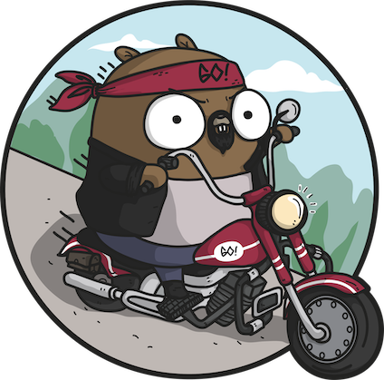

  

<h3 align="center">Goal</h3>

The <b>GOAL</b> of this project is to learn the Go programming language

    
    
    

---
# GOAL

This is the repository used to do all the exercise from the course:

## Levels
The course is divided in Levels. On each level there are exercises of specific topics:

- [Level1](level1): Development environment. Variables, values and type.
- [Level2](level2): Programming fundamentals
- [Level3](level3): Control Flow
- [Level4](level4): Grouping Data
- [Level5](level5): Stucts
- [Level6](level6): Functions
- [Level7](level7): Pointers
- [Level8](level8): JSON
- [Level9](level9): Concurrency
- [Level10](level10): Channels
- [Level11](level11): Errors handling
- [Level12](level12): Documentation
- [Level13](level13): Benchmark, Examples and Testing

---
## License

[MIT](https://choosealicense.com/licenses/mit/)

